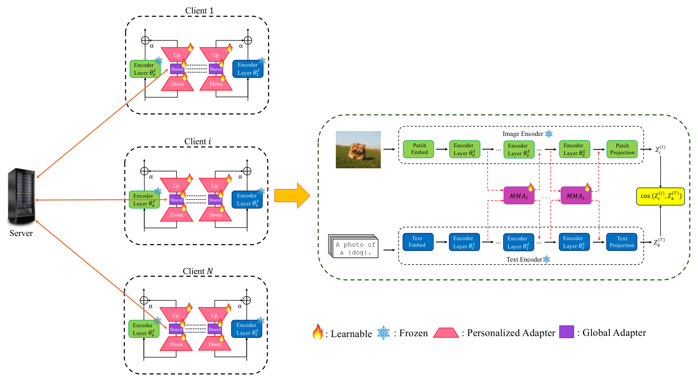

# pFedMMA: Personalized Federated Fine-Tuning with Multi-Modal Adapter for Vision-Language Models
The implementation of paper pFedMMA: Personalized Federated Fine-Tuning with Multi-Modal Adapter for Vision-Language Models.
[[paper]]()

## How to Run

You can run `federated_main.py` with some specified arguments.

## Data Preparation
Please follow the instructions at CoOP https://github.com/KaiyangZhou/CoOp/blob/main/DATASETS.md to prepare the following datasets: SUN397, Caltech101, OxfordPets, Flowers102, Food101, DTD, UCF101.

For CIFAR10 and CIFAR100 datasets, please download and unzip data under `DATA/` file catalog. Or simply run experiments with CIFAR10/CIFAR100 dataset, the program will download data automatically.

For DomainNet and office-caltech10 datasets, please follow the instructions of Dataset described [here](https://github.com/med-air/FedBN/blob/master/README.md). 

### Training

`--root` takes as input a path to dataset.

`--config-file` means which config file to use.

You can select variables like shots, users by changing `cfg` or you can change every arguments you like in scripts.

### Running example
Base-to-Novel Class Generalization: `bash scripts/base2new.sh`

Model Evaluation on Feature & Label Shifts: `bash scripts/DomainNet.sh`

CIFAR-10/CIFAR-100: `bash scripts/pfedmma_cifar.sh`

## Acknowledgement

We would like to thank the authors for releasing the public repository: [MMA](https://github.com/ZjjConan/VLM-MultiModalAdapter), [FedPGP](https://github.com/TianyuCuiOvO/FedPGP/tree/main).

